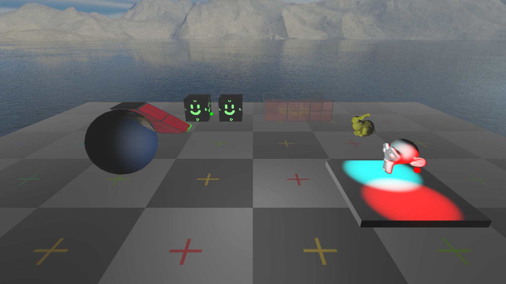

## Assignment 5

Requires Python 3.11 or higher

### What's present (of note)

- Tonemapping (with different operators to choose from)
- Fog (can be linear, exponential or exponential squared)
- Skybox
- Generated meshes
  - Sphere
  - Cube
  - Plane
- Optional specular mapping in shaders
- Multiple lights support (arbitrary maximum of 4)
- Mesh loading from OBJ
- Texturing
- Blending & transparency support (both with actual blending and with simple alpha scissor)
- UV scaling/offset
- Ability to inject code into the standard shader (allows to easily create new effects without having to always duplicate common code)
- Smooth movement along Bezier splines
- and more...

### What I'd like to have added

- More skybox features
  - Compute global ambient color from skybox
  - Skybox rotation
  - Add exposure parameter
- Use buffer indices instead of having to repeat vertex data for position, normal, uv, etc... 
- Code to generate additional meshes
  - More spheres
    - Icosphere
    - Cubesphere
  - Torus
  - Cylinder/Prysm (also counts for cone if you allow different radius for top & bottom)
  - Subdivided plane
- Light types
  - Directional
  - Spotligh
- Normal maps
- Improved mesh loading
  - Parse vertex format and act accordingly instead of assuming it has Positions THEN Normals THEN UVs
  - Parse material
  - Optionally reset model position when importing
- Make object point in direction of Bezier curve
- Sprites & billboards
- Shadows (never actually attempted, maybe just directional)